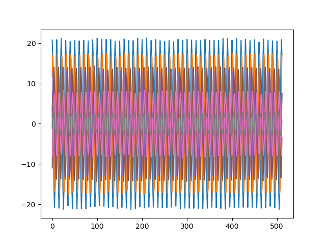

# SpiNR Network - Spiking Neural Resonator Network

## Installation

The SpiNR network is optimized for GPU/CUDA. We do not provide instructions on how to install the right CUDA version.
If you are running into version issues, please use the Docker container for easy usage. Otherwise, the software can be installed via pip.

### pip

Install the repository inside the root folder of the project with the following command 

```pip install -e .```

### Docker

For usage of the Docker container, first build the Docker image with

``` docker build -t spinr-container . ```

Then you can use the ```compose.yaml``` file to run any script within the repository.
Edit line 9 and 10 in the ```compose.yaml``` file to specify the script and run

``` docker compose -f compose.yaml up ```

## Usage

### Test scripts

We provide multiple test scripts that illustrate how to use the repository.

#### Data generation


#### Network (GPU vs CPU)


#### FFT 


#### CFAR


#### Metrics

##### SpiNR
###### CA-CFAR Metrics
batch|target|offset|factor|precision|recall|false positive|false negative
-|-|-|-|-|-|-|-
0.0|0.0|0.075|2.2|0.704313411937333|0.8125|0.4504978378296407|0.36328125
0.0|1.0|0.075|2.2|0.2474357724596213|0.625|0.818396772498335|0.546875
0.0|2.0|0.075|2.2|0.45687763947771165|1.0|0.6321010653313057|0.1796875

###### SNR Metrics

batch|target|snr1|snr2
-|-|-|-
0.0|0.0|0.009014716371893883|0.018198952078819275
0.0|1.0|0.004095181357115507|0.004140193574130535
0.0|2.0|0.013934250921010971|0.014058755710721016

##### FFT
###### CA-CFAR Metrics
batch|target|offset|factor|precision|recall|false positive|false negative
-|-|-|-|-|-|-|-
0.0|0.0|0.07|1.8|0.6377169690585708|0.828125|0.49072920056237007|0.34375
0.0|1.0|0.07|1.8|0.24096696800864875|0.65625|0.8310551770050125|0.53125
0.0|2.0|0.07|1.8|0.396750001049922|1.0|0.6596740235573575|0.15625

###### SNR Metrics

batch|target|snr1|snr2
-|-|-|-
0.0|0.0|0.0048904528291014125|0.009939701410047574
0.0|1.0|0.0022597451494629937|0.0023013984091858238
0.0|2.0|0.0075211605087398305|0.007638303000861752

## Todos

- [ ] Add Loihi2 implementation


